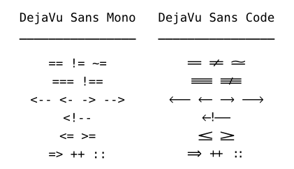

DejaVu Sans Code: monospaced font with programming ligatures
---------------------------

DejaVu Sans Code is monospaced font with programming ligatures based on DejaVu
Sans Mono. This repository is a fork of the
[DejaVu fonts repository](https://github.com/dejavu-fonts/dejavu-fonts).

[Download latest release](https://github.com/SSNikolaevich/DejaVuSansCode/releases/latest).

Currently implemented symbols
---------------------------
== != === !=== <- -> <= => ++

Supported editors
---------------------------
+ KDE Applications: Konsole, KWrite, Kate, KDevelop, etc.
+ Intellij IDEA
+ Qt Creator

